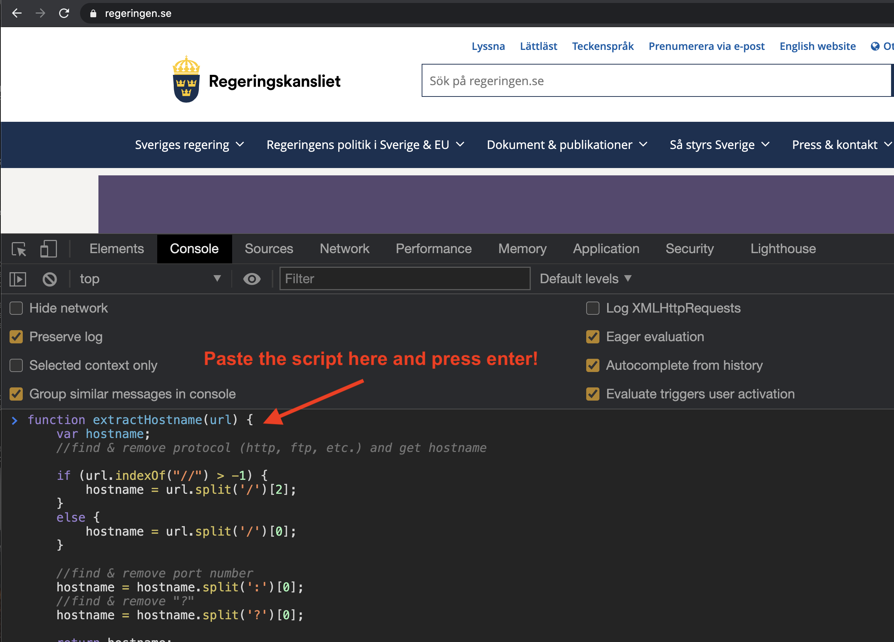

# privacy test your site
Run [this script](https://github.com/tomper00/privacy-test-your-site/blob/main/scan-site.js) to find out what external scripts you request and in what country the server that hosts them lives.

## Notice about this script

The script will actually request other external sites (in the US) so please note that running it, will actually share  data about your browser with these 2 sites:

1. https://dns.google
2. https://get.geojs.io

Note: This script will only look into scripts. Please beware that other resources such as Javascripts, fonts etc might be loaded as well.

Also read our [blogpost](https://www.digitalist.se/blogg/svenska-myndigheter-maste-sluta-att-lacka-data-om-svenska-medborgares-surfvanor) (in Swedish) about why the public sector has to stop leaking data about their users.

Simply paste the code in the browser console to see from which sites you might load scripts.

You can read further down how you can open the developer console in your browser.

The result might look like this:

1. "siteimproveanalytics.com"	"US↵"
2. "www.google-analytics.com"	"US↵"
3. "regstat.regeringen.se"	"SE↵"
4. "www.googletagmanager.com"	"US↵"
5. "play2.qbrick.com"	"SE↵"
6. "play2.qbrick.com"	"SE↵"
7. "play2.qbrick.com"	"SE↵"
8. "play2.qbrick.com"	"SE↵"
9. "httpcache0-90226-cachedown0.dna.qbrick.com"	"SE↵"
10. "play2.qbrick.com"	"SE↵"
11. "imasdk.googleapis.com"	"US↵"
12. "dl.episerver.net"	"US↵"

## How to open the console in different browsers.

### Chrome

To open the developer console in Google Chrome, open the Chrome Menu in the upper-right-hand corner of the browser window and select More Tools > Developer Tools. You can also use the shortcut Option + ⌘ + J (on macOS), or Shift + CTRL + J (on Windows/Linux).

### Firefox

You open the Web Console from a menu or with a keyboard shortcut: Choose Web Console from the Web Developer submenu in the Firefox Menu (or Tools menu if you display the menu bar or are on Mac OS X) Press the Ctrl + Shift + K ( Command + Option + K on OS X) keyboard shortcut

### Internet Explorer

To open the developer console in Internet Explorer, click on the Gear Menu in the upper-right-hand corner of the browser window and select F12 Developer Tools. You can also press F12 to open it. The console will either open up within your existing Internet Explorer window, or in a new window.

### Edge

To open the developer console in Microsoft Edge, open the Edge Menu in the upper-right-hand corner of the browser window and select F12 Developer Tools. You can also press F12 to open it. The console will either open up within your existing Edge window, or in a new window. You may have to select the Console tab.

